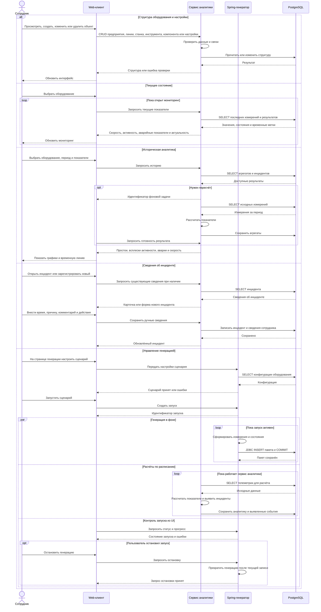
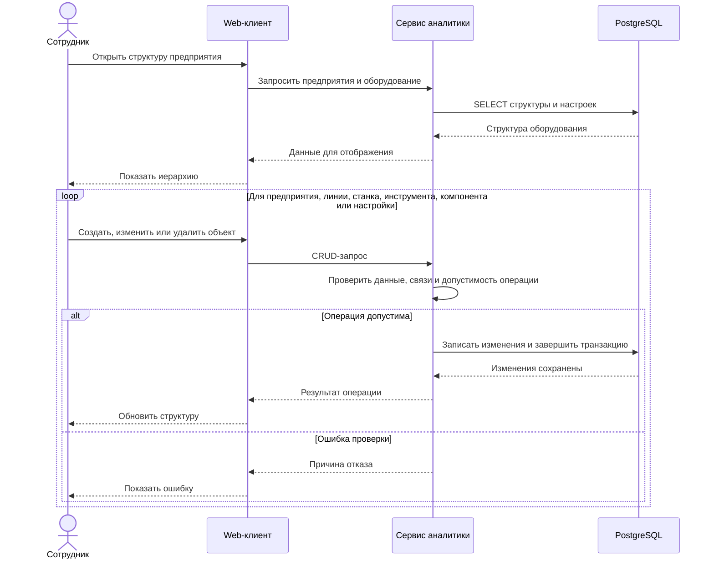
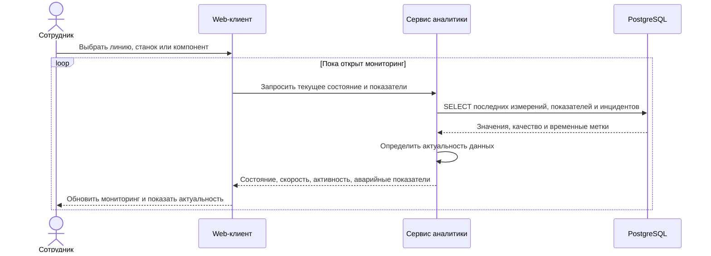
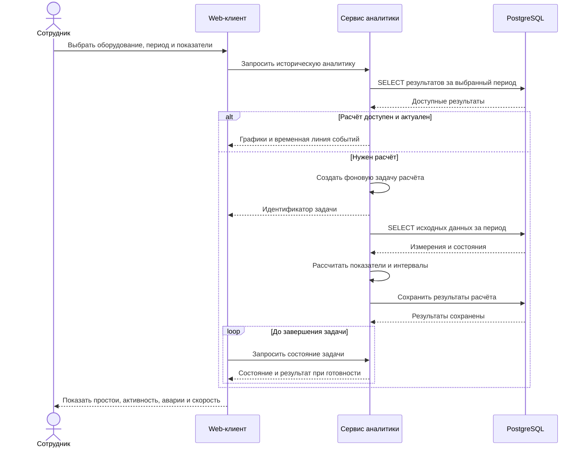
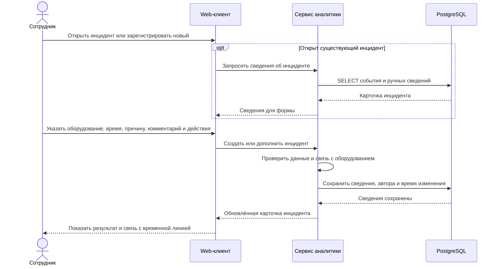
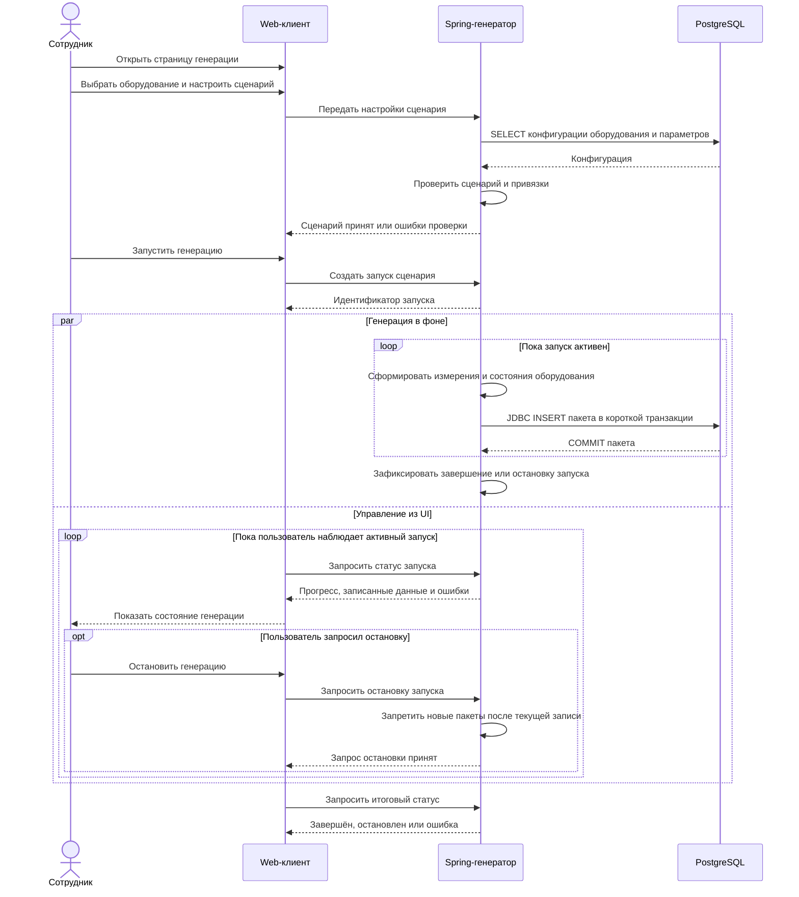
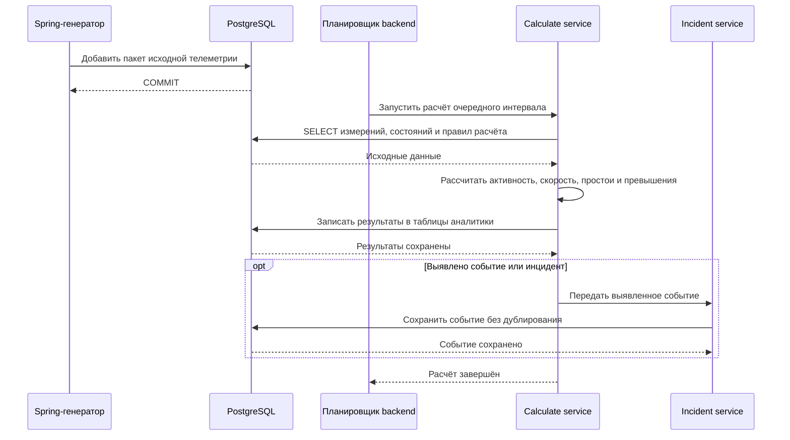

# FKIT BI — архитектура демонстрационной версии

Согласованная основа: веб-клиент, два отдельных Spring-приложения и общая PostgreSQL. Генератор записывает телеметрию напрямую через JDBC. Основной backend управляет оборудованием, читает телеметрию, рассчитывает аналитику и принимает сведения сотрудников об инцидентах. ETL и внешняя шина отложены.

## Компоненты системы

Вложенные блоки — модули соответствующего приложения, а не отдельные микросервисы. Четыре области хранения находятся в одной PostgreSQL. Стрелки к базе обозначают выполняемые запросы. Пунктир обозначает будущую интеграцию.

```mermaid
flowchart TB
    U["Сотрудник предприятия"] --> W["Web-клиент FKIT BI"]

    subgraph BI["Сервис аналитики — Spring-приложение"]
        direction TB
        MC["Machine controller"] --> MS["Machine service: структура и настройки"]
        AC["Analytics controller"] --> CALC["Calculate service: показатели и временная линия"]
        AC --> RAW["Raw data service: чтение измерений"]
        CALC --> RAW
        SCHED["Планировщик расчётов"] --> CALC
        IC["Incident controller"] --> IS["Incident service: события и сведения сотрудников"]
        CALC -->|"Выявленные инциденты"| IS
    end

    subgraph SIM["Сервис генерации — Spring-приложение"]
        direction TB
        GC["API управления генерацией"] --> RUN["Управление сценариями и запусками"]
        RUN --> ENGINE["Движок симуляции оборудования"]
        ENGINE --> BUFFER["Ограниченный буфер"]
        BUFFER --> WRITER["JDBC writer: пакетная запись"]
    end

    subgraph PG["Общая PostgreSQL"]
        direction TB
        CFG[("Структура и настройки оборудования")]
        TEL[("Исходная телеметрия")]
        AGG[("Результаты аналитики")]
        INC[("Инциденты и сведения сотрудников")]
    end

    W -->|"CRUD оборудования и настроек"| MC
    W -->|"Текущее состояние и история"| AC
    W -->|"Просмотр и дополнение инцидентов"| IC
    W -->|"Настройка, запуск, статус, остановка"| GC
    MS -->|"Чтение и изменение"| CFG
    RUN -->|"Чтение конфигурации"| CFG
    WRITER -->|"INSERT пакетов измерений"| TEL
    RAW -->|"SELECT"| TEL
    CALC -->|"Чтение и запись агрегатов"| AGG
    IS -->|"Чтение и запись"| INC

    subgraph FUTURE["Будущая интеграция — вне демо"]
        BUS["Внешняя шина: протокол не выбран"]
        ETL["ETL: чтение, преобразование и запись"]
        BUS -.-> ETL
    end
    ETL -.->|"Тот же контракт телеметрии"| TEL
```

| Область | Ответственность |
| --- | --- |
| Структура оборудования | Предприятие → линии → станки. Инструменты и компоненты привязаны к станку; параметры и настройки — к станку или компоненту. CRUD выполняет основной backend. |
| Телеметрия | Генератор добавляет исходные измерения и состояния. Backend читает их и не изменяет при расчётах. |
| Аналитика | Текущее состояние, скорость, активность, всплески, аварийные показатели, интервалы простоя и исторические агрегаты. Расчёты выполняет backend. |
| Инциденты | Обнаруженные события и внесённые сотрудниками причины, комментарии, действия. Ручные сведения хранятся отдельно от исходных измерений. |
| Генерация | Отдельный раздел web-клиента управляет сценариями и запусками через API генератора. |

## Общая последовательность всех пользовательских сценариев

Ветви `alt` обозначают разные действия пользователя. Генерация и фоновая аналитика работают независимо. Детальные последовательности приведены ниже.

## 1. Управление структурой оборудования и настройками

Одна последовательность применяется ко всем CRUD-операциям. Иерархию создают от предприятия к линии и станку, затем добавляют инструменты, компоненты и настройки. Правила удаления зависимых объектов проверяет backend.

## 2. Просмотр текущего состояния оборудования

Для демо предлагается периодический опрос API. Это обновление с небольшой задержкой, а не гарантия жёсткого реального времени. Ответ содержит время измерений и время расчёта, чтобы UI отличал свежие значения от устаревших.

## 3. Историческая аналитика и временная линия

Включает выбор периода, просмотр простоев, всплесков активности, аварий и скорости. Для демо готовые агрегаты читаются сразу; отсутствующий расчёт запускается в фоне и получает идентификатор задачи. Это предлагаемое поведение API.

## 4. Внесение сотрудником сведений об инциденте

Сотрудник может дополнить обнаруженное событие или зарегистрировать инцидент вручную. Ручная запись описывает факт и не переписывает исходную телеметрию.

## 5. Настройка, запуск, статус и остановка генерации

Предусловие: структура оборудования и параметры уже созданы. Для демо настройки сценариев и состояние запуска могут храниться в памяти генератора; их сохранение после перезапуска пока не заявлено.

## 6. Фоновая обработка новых измерений

Планировщик работает внутри сервиса аналитики. Обработка запускается независимо от генератора и web-клиента. Для демо предлагается пересчитывать недавний временной интервал с учётом запоздавших данных и идемпотентно заменять результаты соответствующих интервалов; алгоритм обработки запоздавших данных уточняется в контракте.

## Границы ответственности

- Генератор пишет исходные измерения; основной backend читает их и пишет структуру, аналитику и сведения об инцидентах.
- Оба приложения используют один согласованный контракт таблиц и согласованные миграции. Проверки телеметрии выполняет писатель; ограничения целостности обеспечивает база.
- Генерация и расчёты выполняются в фоне. HTTP-запуск генерации не держит запрос открытым на весь сценарий.
- Для исходной телеметрии используются короткие пакетные транзакции и защита от повторной записи. JDBC или R2DBC сами по себе не устраняют дедлоки.
- Период опроса UI, период расчётов, частота генерации и пределы нагрузки ещё не определены.
- Сценарии прогнозирования, подключение реальной шины и ETL не входят в текущую демо-версию.
