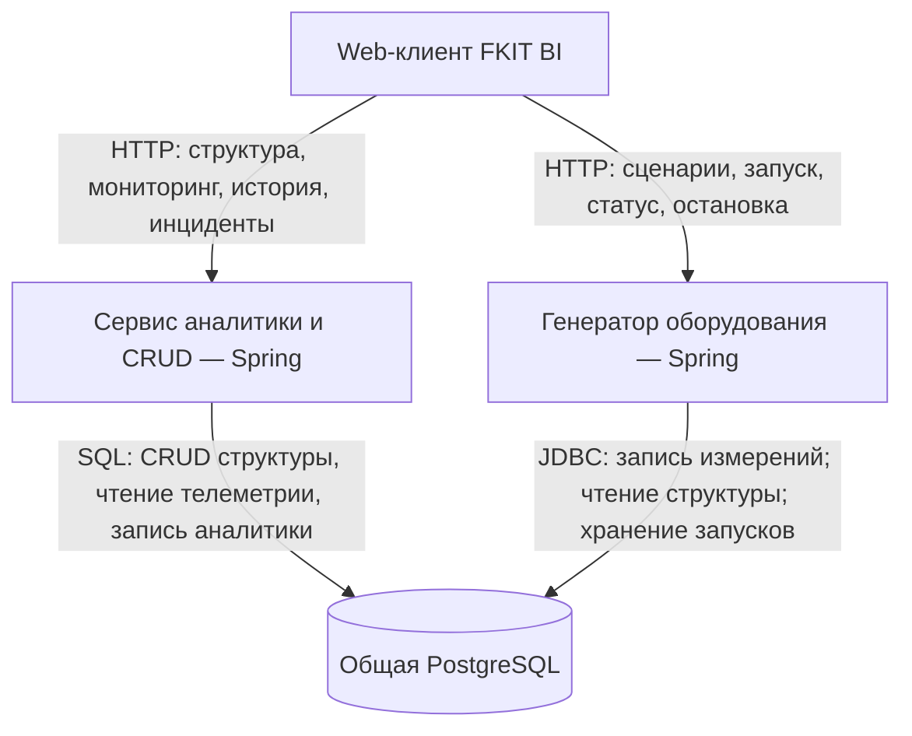
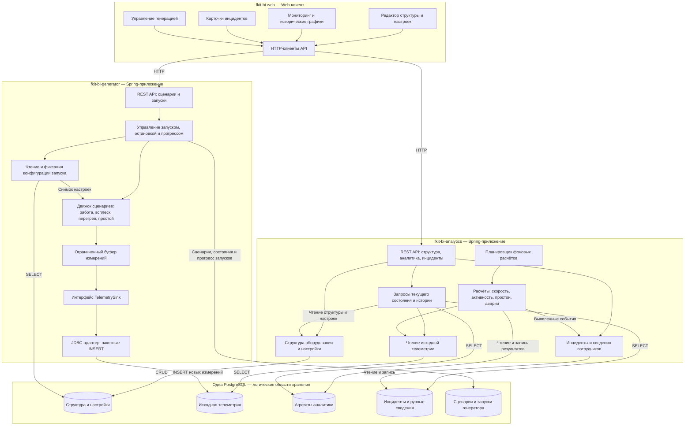

# FKIT BI: компоненты демо и границы репозиториев

Предлагаемая архитектура: два отдельных Spring-приложения, Web-клиент и одна PostgreSQL. Генератор пишет телеметрию напрямую через JDBC. Kafka и ETL отложены.

## 1. Уровень сервисов

Стрелки показывают направление запросов и операций. База возвращает результаты чтения.

Аналитика и генератор запускаются независимо. Между ними нет обязательных HTTP-вызовов. Web обращается к API обоих приложений; для демо обновляет мониторинг периодическим опросом. PostgreSQL — общий ресурс, но права записи разделены по областям данных.

## 2. Уровень компонентов внутри приложений

Вложенный блок приложения — один процесс и один репозиторий. Каждый внутренний блок — логический модуль, а не отдельный микросервис. Стрелки между модулями показывают вызовы, стрелки к данным — операции хранения.

Доступ к PostgreSQL выполняют repository/DAO-адаптеры соответствующих модулей; они не выделены в отдельные сервисы. Пять областей хранения — предложенное разделение таблиц, а не пять баз.

## 3. Репозитории

| Репозиторий | Что хранить | Результат |
| --- | --- | --- |
| `fkit-bi-analytics` | Spring-приложение; CRUD предприятий, линий, станков, инструментов, компонентов и параметров; чтение телеметрии; расчёты; инциденты; OpenAPI; миграции общей БД и контракт таблиц телеметрии | Образ сервиса аналитики |
| `fkit-bi-generator` | Spring-приложение; API управления; сценарии и запуски; движок генерации; буфер; интерфейс `TelemetrySink`; JDBC-адаптер; OpenAPI | Образ генератора |
| `fkit-bi-web` | Редактор структуры, настройки, мониторинг, история, инциденты, страница генерации; API-клиенты | Сборка Web-клиента |
| `fkit-bi-infra` | Docker Compose для демо; конфигурация PostgreSQL и прокси; шаблоны переменных окружения без секретов; запуск миграций и приложений; инструкции запуска | Воспроизводимое окружение демо |

Для твоей части — два репозитория Java-приложений и репозиторий окружения. Web остаётся отдельным репозиторием разработчика фронтенда. Для самого PostgreSQL репозиторий приложения не нужен.

## 4. Ответственность за данные и контракты

| Область | Кто записывает | Кто читает |
| --- | --- | --- |
| Структура и настройки оборудования | Сервис аналитики | Аналитика и генератор |
| Исходная телеметрия | Генератор: только новые измерения | Сервис аналитики |
| Агрегаты | Расчётный модуль аналитики | API аналитики |
| Инциденты и ручные сведения | Модуль инцидентов аналитики | API аналитики |
| Сценарии и состояния запусков | Генератор | API генератора |

Иерархия: предприятие → производственные линии → станки → инструменты и компоненты. Параметры и настройки принадлежат станку или его компоненту.

Для демо предлагается один владелец миграций: `fkit-bi-analytics`. Он хранит миграции всех областей общей базы, включая таблицы запусков генератора. В `fkit-bi-infra` находится только их запуск: миграции применяются одним процессом до запуска обоих приложений. Это предотвращает конкурирующее управление одной схемой.

Контракт телеметрии версионируется рядом с миграциями в `fkit-bi-analytics/docs/contracts`: таблицы, поля, типы, идентификаторы, время измерения, качество, правила пакетной записи и защиты от дублей. Генератор реализует согласованную версию контракта. Отдельный репозиторий общей Java-библиотеки для первой демоверсии не требуется.

Сценарий генерации фиксирует снимок настроек при запуске. Генератор не изменяет справочники оборудования. Удаление участвующих в запуске объектов должно согласовываться с остановкой генерации; для первого демо физическое удаление можно запретить и использовать архивирование.

## 5. Переход к шине позже

Движок формирует измерения и передаёт их через `TelemetrySink`. В демо этот интерфейс реализует JDBC-адаптер. В будущем можно добавить адаптер отправки в Kafka, а запись в PostgreSQL передать отдельному ETL-приложению и репозиторию `fkit-bi-ingestion`. CRUD и чтение аналитики при сохранении контракта данных останутся на своих местах.

В текущий состав демо Kafka и ETL не входят. Диаграммы прецедентов и последовательности в этом документе не изменяются и не создаются.
